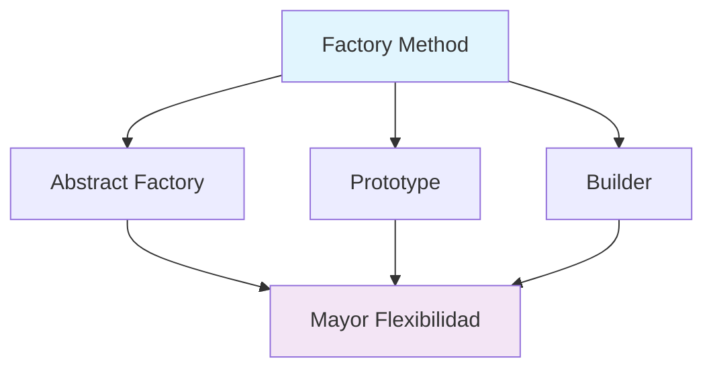

---
tags:
  - 📦DSW
  - 📝NOT
cssclasses:
  - center-titles
  - embed-auto
  - embed-inverse
---

# Patrones de Diseño Creacionales

## 1. Singleton - Perspectiva Profundizada

> [!info] Criterios de Aplicación
> El patrón Singleton solo debe considerarse si se cumplen **los tres criterios** siguientes:
> - La propiedad de la instancia única no puede asignarse razonablemente
> - La inicialización perezosa es deseable
> - El acceso global no está proporcionado de otra manera


### 1.1 Consideraciones Críticas

> [!warning] Advertencias Importantes
> - **Singleton vs Variables Globales**: "Un Singleton es, a todos los efectos, una variable global. El Singleton no elimina lo global; simplemente lo renombra."
> - **Uso Inapropiado**: "El patrón de diseño Singleton es uno de los patrones más usados inapropiadamente."
> - **Problema de Visibilidad**: "El verdadero problema con los Singletons es que te dan una buena excusa para no pensar cuidadosamente sobre la visibilidad apropiada de un objeto."

### 1.2 Checklist de Implementación

```java
public class Database {
    // 1. Atributo static privado
    private static Database instance;
    
    // 4. Constructores privados o protegidos
    private Database() {
        // Inicialización
    }
    
    // 2. Método de acceso público static
    public static Database getInstance() {
        // 3. Inicialización perezosa
        if (instance == null) {
            instance = new Database();
        }
        return instance;
    }
}
```

> [!danger] Problemas de Diseño
> - **Eliminación**: "Eliminar una clase/instancia Singleton es un problema de diseño no trivial"
> - **Subclasificación**: "El enfoque del 'método de acceso estático' no admite la subclasificación de la clase Singleton"

---

## 2. Prototype - Mecanismos Avanzados

> [!info] Definición Ampliada
> "Co-optar una instancia de una clase para su uso como criadora de todas las instancias futuras. El operador `new` considerado dañino."


### 2.1 Registro de Prototipos

```java
// Registro que mantiene un caché de objetos prototípicos
class PrototypeRegistry {
    private static Map<String, Prototype> prototypes = new HashMap<>();
    
    static {
        prototypes.put("circle", new Circle());
        prototypes.put("rectangle", new Rectangle());
    }
    
    public static Prototype getPrototype(String type) {
        return prototypes.get(type).clone();
    }
}
```

### 2.2 Comparativa Factory Method vs Prototype

| **Aspecto** | **Factory Method** | **Prototype** |
|-------------|-------------------|---------------|
| **Mecanismo** | Creación por herencia | Creación por delegación |
| **Subclases** | Requiere subclasificación | No requiere subclasificación |
| **Inicialización** | No requiere Initialize | Requiere operación Initialize |
| **Flexibilidad** | Menos complejo, más personalizable | Más flexible, más complejo |

> [!tip] Casos Ideales para Prototype
> - Cuando la inicialización de objetos es costosa
> - Anticipas pocas variaciones en los parámetros de inicialización
> - Puede evitar la "creación desde cero" costosa
> - Soporta clonación económica de un prototipo pre-inicializado

---

## 3. Factory Method - Evolución Natural

> [!info] Definición Popular
> "Un método `static` de una clase que devuelve un objeto del tipo de esa clase. Pero a diferencia de un constructor, el objeto real que devuelve podría ser una instancia de una subclase."


### 3.1 Relación con Template Method

```java
abstract class Application {
    // Template Method
    public void run() {
        Document doc = createDocument(); // Factory Method
        doc.open();
        // ... lógica común
    }
    
    // Factory Method
    public abstract Document createDocument();
}
```

> [!note] Evolución de Patrones
> "A menudo, los diseños comienzan usando **Factory Method** (menos complicado, más personalizable, las subclases proliferan) y evolucionan hacia **Abstract Factory**, **Prototype** o **Builder** (más flexible, más complejo) a medida que el diseñador descubre dónde se necesita más flexibilidad."

---

## 4. Abstract Factory - Plataformas y Familias

> [!info] Propósito Específico
> "Proporcionar una interfaz para crear familias de objetos relacionados o dependientes sin especificar sus clases concretas. Una jerarquía que encapsula: muchas 'plataformas' posibles, y la construcción de un conjunto de 'productos'."


### 4.1 Implementación con Singleton

```java
public interface GUIFactory {
    Button createButton();
    Checkbox createCheckbox();
    
    // Patrón Singleton integrado
    static GUIFactory getInstance() {
        String os = System.getProperty("os.name").toLowerCase();
        if (os.contains("win")) {
            return WinFactory.getInstance();
        } else if (os.contains("mac")) {
            return MacFactory.getInstance();
        }
        throw new UnsupportedOperationException("OS not supported");
    }
}
```

> [!success] Ventaja Clave
> "Este mecanismo hace que el intercambio de familias de productos sea fácil porque la clase específica del objeto de fábrica aparece solo una vez en la aplicación - donde se instancia."

---

## 5. Builder - Construcción Compleja

> [!info] Enfoque Específico
> "Separar el algoritmo para interpretar (leer y analizar) un mecanismo de persistencia almacenado del algoritmo para construir y representar uno de los muchos productos objetivo."


### 5.1 Director y Builder

```java
// Director - Controla el proceso de construcción
class DocumentReader {
    public Document construct(Builder builder) {
        builder.buildHeader();
        builder.buildBody();
        builder.buildFooter();
        return builder.getResult();
    }
}

// Builder - Implementa la construcción específica
interface Builder {
    void buildHeader();
    void buildBody();
    void buildFooter();
    Document getResult();
}
```

> [!example] Analogía del Mundo Real
> "El patrón Builder es utilizado por los restaurantes de comida rápida para construir comidas infantiles. Las comidas infantiles típicamente consisten en un artículo principal, un artículo secundario, una bebida y un juguete."

---

## 6. Object Pool - Nuevo Patrón Creacional

> [!info] Propósito
> "Object pooling puede ofrecer un aumento significativo del rendimiento; es más efectivo en situaciones donde el costo de inicializar una instancia de clase es alto, la tasa de creación de instancias de una clase es alta, y el número de instanciaciones en uso en cualquier momento es bajo."


### 6.1 Estructura del Object Pool

| **Rol** | **Responsabilidad** |
|---------|-------------------|
| **Reusable** | Objetos que colaboran por tiempo limitado |
| **Client** | Usa objetos Reusable |
| **ReusablePool** | Gestiona objetos Reusable para uso de Client |

### 6.2 Implementación

```java
public class ConnectionPool {
    private static ConnectionPool instance;
    private List<Connection> available = new ArrayList<>();
    private List<Connection> inUse = new ArrayList<>();
    private int maxPoolSize = 10;
    
    private ConnectionPool() {
        // Inicializar pool
    }
    
    public static ConnectionPool getInstance() {
        if (instance == null) {
            instance = new ConnectionPool();
        }
        return instance;
    }
    
    public Connection acquireConnection() {
        if (available.isEmpty()) {
            if (inUse.size() < maxPoolSize) {
                available.add(createNewConnection());
            } else {
                throw new RuntimeException("Pool exhausted");
            }
        }
        Connection conn = available.remove(0);
        inUse.add(conn);
        return conn;
    }
    
    public void releaseConnection(Connection conn) {
        inUse.remove(conn);
        available.add(conn);
    }
}
```

> [!success] Beneficios
> - Evita la costosa adquisición y liberación de recursos
> - Recicla objetos que ya no están en uso
> - Mejora significativa del rendimiento

---

## 7. Reglas de Oro y Comparativas

> [!info] Relaciones entre Patrones Creacionales

### 7.1 Competencia y Complementariedad

| **Relación** | **Descripción** |
|--------------|-----------------|
| **Abstract Factory vs Prototype** | A veces competidores, a veces complementarios |
| **Abstract Factory + Prototype** | Abstract Factory puede almacenar Prototypes para clonar |
| **Builder + Otros Patrones** | Builder puede usar otros patrones para implementar componentes |
| **Factory Method + Template Method** | Los Factory Methods se llaman dentro de Template Methods |

### 7.2 Evolución Natural del Diseño



> [!note] Progresión de Complejidad
> "Los diseños a menudo comienzan usando **Factory Method** (menos complicado, más personalizable, las subclases proliferan) y evolucionan hacia **Abstract Factory**, **Prototype** o **Builder** (más flexible, más complejo) a medida que el diseñador descubre dónde se necesita más flexibilidad."

### 7.3 Comparativa Detallada

| **Patrón** | **Enfoque** | **Complejidad** | **Flexibilidad** | **Casos de Uso** |
|------------|-------------|-----------------|------------------|------------------|
| **Factory Method** | Creación por herencia | Baja | Media | Frameworks arquitectónicos |
| **Abstract Factory** | Familias de productos | Media | Alta | Dependencias de plataforma |
| **Builder** | Construcción paso a paso | Alta | Muy Alta | Objetos complejos |
| **Prototype** | Clonación de instancias | Media | Alta | Inicialización costosa |
| **Singleton** | Instancia única | Baja | Baja | Recursos globales |
| **Object Pool** | Reutilización de recursos | Media | Media | Recursos costosos |

---

## 8. Principios de Diseño y Mejores Prácticas

> [!warning] El Operador `new` Considerado Dañino
> "Hay una diferencia entre solicitar un objeto y crear uno. El operador `new` siempre crea un objeto y no logra encapsular la creación de objetos. Un Factory Method impone esa encapsulación y permite que se solicite un objeto sin un acoplamiento inextricable con el acto de creación."

> [!success] Recomendación de Estilo
> "Algunos defensores de Factory Method recomiendan que, como cuestión de diseño de lenguaje (o, si no, como cuestión de estilo), absolutamente todos los constructores deberían ser privados o protegidos. No es asunto de nadie más si una clase fabrica un nuevo objeto o recicla uno viejo."

> [!bug] Fórmula de Evaluación de Complejidad
> $$
> C = \frac{I \times D}{E}
> $$
> Donde:
> - $C$ = Complejidad del patrón
> - $I$ = Nivel de indirección introducido
> - $D$ = Dependencias creadas
> - $E$ = Flexibilidad ganada

---

**NOTA PARA ESTUDIANTES AVANZADOS**: Estos patrones no son soluciones aisladas, sino herramientas que evolucionan naturalmente en proyectos complejos. La clave está en reconocer cuándo un patrón simple ya no es suficiente y escalar estratégicamente hacia patrones más flexibles manteniendo siempre la simplicidad como principio rector.
