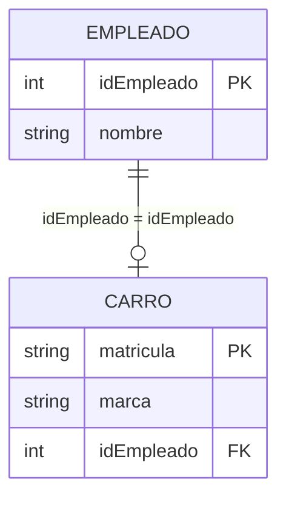
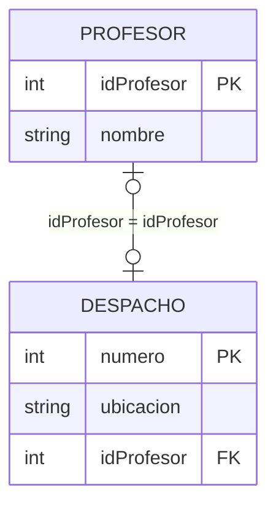
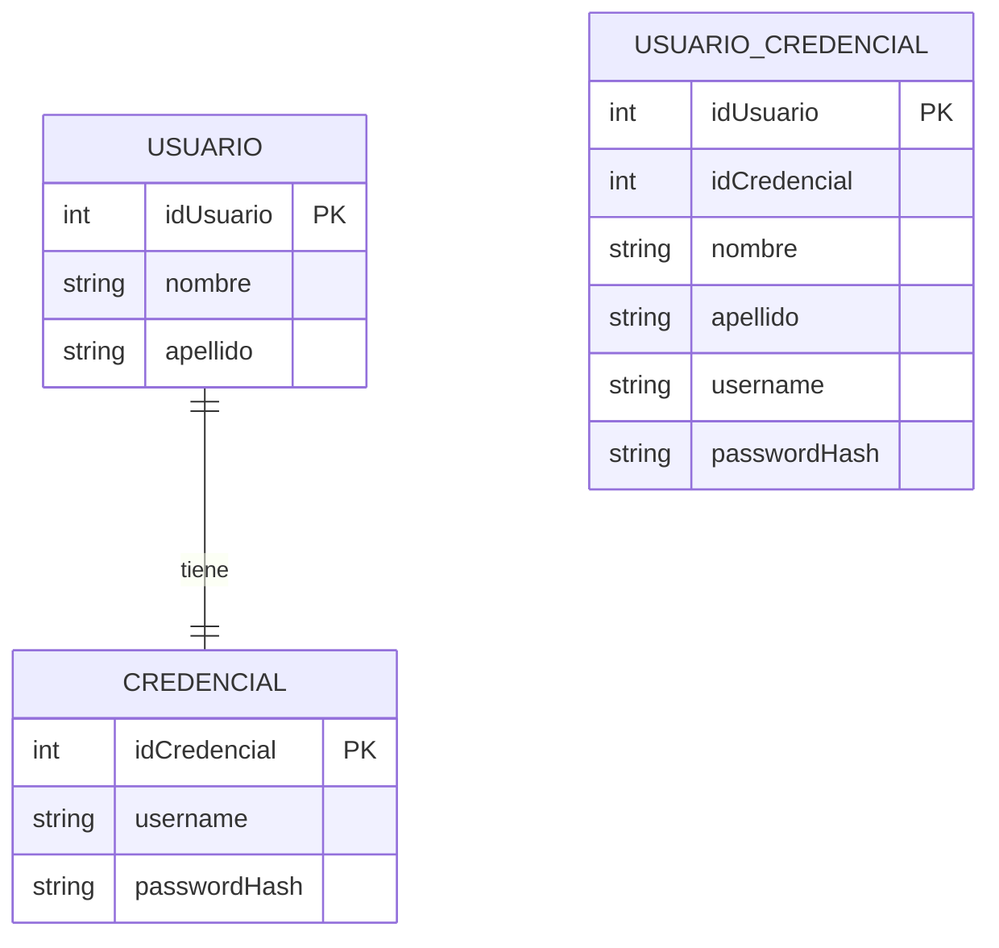
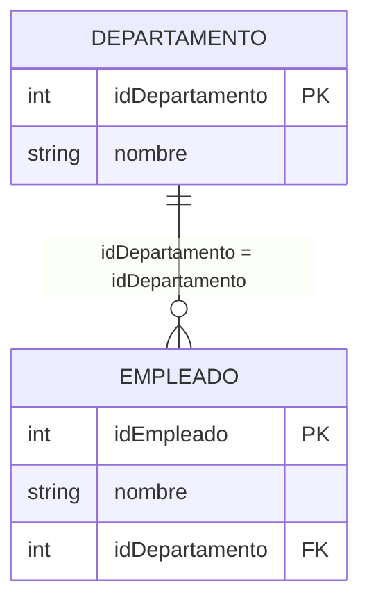
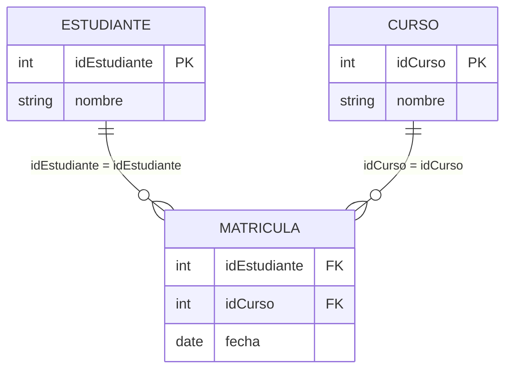
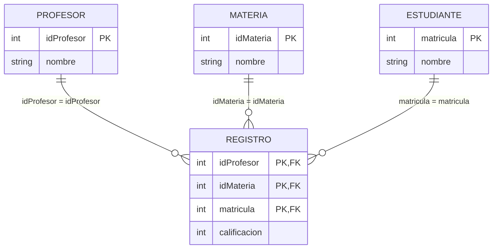
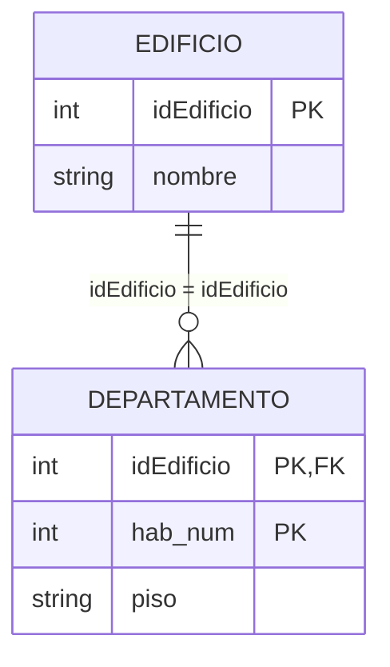
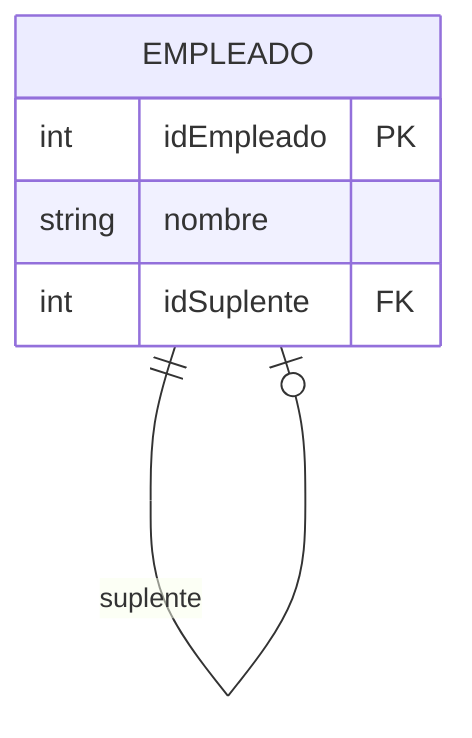
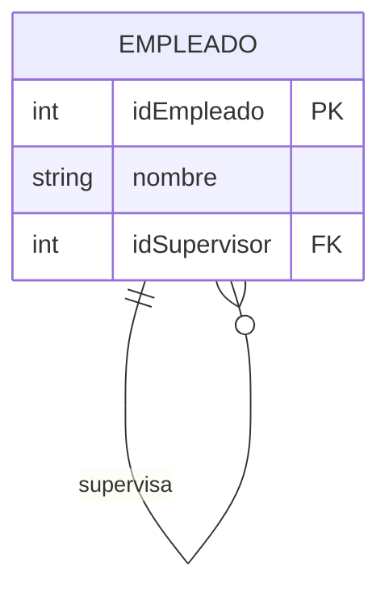
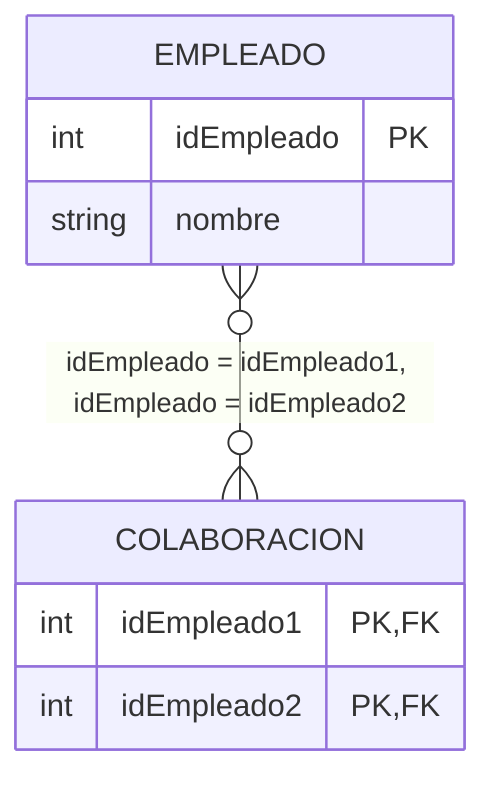

---
tags:
  - 🗃️SBD
  - 📝NOT
cssclasses:
  - center-titles
  - embed-inverse
---

# 🗃️ Sistemas de Bases de Datos - Guía para Examen

## 1. Modelo Conceptual de Datos

### 1.1 Elementos Fundamentales

> [!info] Conceptos Clave
> El modelo conceptual es una representación gráfica de la estructura del mundo real, enfocada en cómo los datos serán almacenados y administrados.

**Entidades**: Objetos del mundo real que se desean representar
- **Tangibles**: Persona, cosa, lugar
- **Intangibles**: Concepto, venta  
- **Eventos**: Concierto, compra

**Atributos**: Cualidades de una entidad
- **Simple**: Atómico, no divisible (salario, primer apellido)
- **Compuesto**: Múltiples componentes (fecha, dirección)
- **Derivado**: Se calcula (edad, subtotal)
- **Multivaluado**: Múltiples valores (teléfonos)

**Clave Primaria (PK)**: Identificador único
- No puede ser nula
- Puede ser simple, compuesta o artificial

**Relaciones**: Asociaciones entre entidades

### 1.2 Relaciones Especiales

> [!warning] Relaciones Complejas
> Estas relaciones requieren atención especial en el diseño

**Relación Ternaria**: Involucra tres entidades
- Ejemplo: PROFESOR dicta ASIGNATURA a ESTUDIANTE

**Relación Débil**: No puede existir sin la entidad fuerte
- PK incluye la PK de la entidad fuerte

**Relación Recursiva**: Entidad se relaciona consigo misma
- Ejemplo: EMPLEADO supervisa a EMPLEADO

---

## 2. Modelo Lógico y Normalización

### 2.1 Proceso de Diseño de Bases de Datos

> [!info] Tres Etapas Principales
> El diseño de una base de datos sigue un proceso estructurado en tres fases principales:

| Etapa                 | Objetivo                                 | Resultado                      |
| --------------------- | ---------------------------------------- | ------------------------------ |
| **Diseño Conceptual** | Identificar datos y restricciones        | Modelo Entidad-Relación (ERD)  |
| **Diseño Lógico**     | Crear tablas, relaciones y restricciones | Esquema relacional normalizado |
| **Diseño Físico**     | Implementar procedimientos y triggers    | Base de datos operativa        |

### 2.2 Conversión de Entidades

> [!success] Reglas Básicas
> - Cada **entidad** se transforma en una **tabla**
> - Los **atributos** se convierten en **columnas**
> - Las **claves primarias** se mantienen

| Modelo Conceptual               | Modelo Lógico                                 |
| ------------------------------- | --------------------------------------------- |
| `CLIENTE` entidad               | `CLIENTE` tabla                               |
| `idCliente` (PK)                | `idCliente INT PRIMARY KEY`                   |
| `Nombre`, `Dirección` atributos | `Nombre VARCHAR(30)`, `Dirección VARCHAR(50)` |

### 2.3 Conversión de Relaciones 1:1

#### Caso 1: Una Entidad Opcional y la otra Obligatoria

> [!info] Regla
> La tabla **opcional** almacena como FK la PK de la tabla **obligatoria**



#### Caso 2: Ambas Entidades Opcionales

> [!info] Regla
> Se decide cuál es la **clase padre** y cuál la **clase hijo**. La PK del padre se copia al hijo como FK.



#### Caso 3: Ambas Entidades Obligatorias

> [!info] Regla  
> Se pueden **unificar en una sola tabla** y se puede elegir como PK a cualquiera de las entidades originales.



### 2.4 Relaciones 1:M (Uno a Muchos)

> [!success] Regla General
> La **PK del lado "1"** se propaga como **FK al lado "M"**, independientemente de la obligatoriedad.



### 2.5 Relaciones M:M (Muchos a Muchos)

> [!warning] Regla
> Siempre se crea una **tabla intermedia** con las PKs de ambas entidades como FKs.



### 2.6 Relaciones Ternarias

> [!info] Regla General
> Se crea una nueva tabla con las **PK de las tres tablas** como FKs, más los atributos de la relación.



### 2.7 Relaciones de Dependencia (Entidades Débiles)

> [!warning] Característica Clave
> La entidad débil tiene **clave compuesta** que incluye la PK de la entidad fuerte.



### 2.8 Relaciones Recursivas

#### Relación Recursiva 1:1



#### Relación Recursiva 1:M



#### Relación Recursiva M:M



### 2.9 Normalización de Bases de Datos

> [!quote] Propósito
> "La normalización evita la redundancia de datos, problemas de actualización y protege la integridad de los datos."

#### Formas Normales

| Forma Normal | Descripción                        | Base                     |
| ------------ | ---------------------------------- | ------------------------ |
| 1FN          | Atributos atómicos, clave primaria | Estructura básica        |
| 2FN          | Dependencia completa de la clave   | Claves compuestas        |
| 3FN          | Eliminar dependencias transitivas  | Dependencias funcionales |

#### Primera Forma Normal (1FN)

> [!success] Requisitos
> - Atributos atómicos
> - Clave primaria única
> - Sin grupos repetitivos

| ❌ Antes (No 1FN)                 | ✅ Después (1FN)                  |
| --------------------------------- | --------------------------------- |
| `Cliente {ID, Nombre, Teléfonos}` | `Cliente {ID, Nombre}`            |
|                                   | `Telefono {ID_Cliente, Telefono}` |

#### Segunda Forma Normal (2FN)

> [!warning] Solo para claves compuestas
> Atributos no clave deben depender de **toda la clave**

| ❌ No 2FN                                               | ✅ 2FN                              |
| ------------------------------------------------------- | ----------------------------------- |
| `EmpleadoHabilidad {Empleado, Habilidad, LugarTrabajo}` | `Empleado {Empleado, LugarTrabajo}` |
|                                                         | `Habilidad {Empleado, Habilidad}`   |

#### Tercera Forma Normal (3FN)

> [!danger] Eliminar dependencias transitivas
> Atributos no clave no deben depender de otros atributos no clave

| ❌ No 3FN                                        | ✅ 3FN                               |
| ------------------------------------------------ | ------------------------------------ |
| `Torneo {Torneo, Año, Ganador, FechaNacimiento}` | `Torneo {Torneo, Año, Ganador}`      |
|                                                  | `Ganador {Ganador, FechaNacimiento}` |

---

## 3. Álgebra Relacional

### 3.1 Operadores Básicos

> [!info] Definición
> El **álgebra relacional** es un lenguaje de consulta procedural que consiste en un conjunto de operaciones que toman una o dos relaciones como entrada y producen una nueva relación como resultado.

**Proyección (π)**: Selecciona columnas
```algebra
π nombre, rating (Marineros)
```

**Selección (σ)**: Filtra filas
```algebra
σ rating > 8 (Marineros)
```

**Producto Cartesiano (×)**: Combina todas las tuplas
```algebra
S1 × R1
```

**Reunión Natural (⨝)**: Combina por atributos comunes
```algebra
EMPLEADO ⨝ DEPARTAMENTO
```

### 3.2 Operadores de Conjunto

**Unión (∪)**: Tuplas en R o S
```algebra
S1 ∪ S2
```

**Diferencia (−)**: Tuplas en R pero no en S
```algebra
S1 − S2
```

**Intersección (∩)**: Tuplas en R y S
```algebra
ADMINISTRADOR ∩ PRODUCTOR
```

### 3.3 Operaciones Avanzadas

**Renombramiento (ρ)**: Cambia nombres
```algebra
ρ nuevo_nombre (Relación)
```

**Agrupación (γ)**: Funciones de agregación
```algebra
γ rating; avg(edad)→promedio (Marineros)
```

### 3.4 Funciones de Agregación

| Función | Descripción         | Ejemplo                   |
| ------- | ------------------- | ------------------------- |
| COUNT   | Número de elementos | G count(mid) (Marineros)  |
| SUM     | Suma de valores     | G sum(rating) (Marineros) |
| AVG     | Promedio de valores | G avg(edad) (Marineros)   |
| MAX     | Valor máximo        | G max(edad) (Marineros)   |
| MIN     | Valor mínimo        | G min(edad) (Marineros)   |

---

## 4. SQL - Data Definition Language (DDL)

### 4.1 CREATE TABLE

> [!bug] Sintaxis Básica
> ```sql
> CREATE TABLE nombre_tabla (
>     columna1 tipo_dato [restricciones],
>     columna2 tipo_dato [restricciones],
>     [restricciones de tabla]
> );
> ```

**Tipos de datos comunes:**
- `CHAR(n)`, `VARCHAR(n)` - Cadenas
- `INTEGER`, `NUMERIC` - Números  
- `DATE`, `TIMESTAMP` - Fechas
- `SERIAL`/`AUTO_INCREMENT` - Auto-incremental

**Restricciones principales:**
- `PRIMARY KEY` - Clave primaria
- `FOREIGN KEY` - Clave foránea
- `NOT NULL` - No nulo
- `UNIQUE` - Valores únicos
- `CHECK` - Validación personalizada

> [!example] Ejemplo Completo
> ```sql
> -- Tabla de Usuarios del Sistema
> CREATE TABLE Usuarios (
>     id_usuario INT AUTO_INCREMENT PRIMARY KEY,
>     nombre VARCHAR(100) NOT NULL,
>     correo VARCHAR(120) UNIQUE NOT NULL,
>     fecha_registro DATE DEFAULT CURRENT_DATE,
>     edad INT CHECK (edad >= 18),       -- CHECK: Usuarios deben ser mayores de edad
>     estado VARCHAR(20) DEFAULT 'activo'
> );
> 
> -- Tabla de Proyectos
> CREATE TABLE Proyectos (
>     id_proyecto INT AUTO_INCREMENT PRIMARY KEY,
>     nombre VARCHAR(150) NOT NULL,
>     presupuesto DECIMAL(12,2) NOT NULL CHECK (presupuesto >= 0),
>     fecha_inicio DATE NOT NULL,
>     fecha_fin DATE,
>     CHECK (fecha_fin IS NULL OR fecha_inicio <= fecha_fin)  
>     -- CHECK para validar que no termine antes de comenzar
> );
> 
> -- Tabla que relaciona Usuarios con Proyectos (M:N)
> CREATE TABLE Proyecto_Usuarios (
>     id_proyecto INT NOT NULL,
>     id_usuario INT NOT NULL,
>     rol VARCHAR(50) DEFAULT 'colaborador',
> 
>     PRIMARY KEY (id_proyecto, id_usuario), -- PK compuesta
> 
>     FOREIGN KEY (id_proyecto) 
>         REFERENCES Proyectos(id_proyecto)
>         ON DELETE CASCADE,   -- Si se elimina un proyecto → se eliminan sus relaciones
> 
>     FOREIGN KEY (id_usuario)
>         REFERENCES Usuarios(id_usuario)
>         ON UPDATE CASCADE    -- Si cambia id_usuario, se actualiza aquí también
> );
> 
> -- Tabla de Tareas del Proyecto
> CREATE TABLE Tareas (
>     id_tarea INT AUTO_INCREMENT PRIMARY KEY,
>     descripcion VARCHAR(200) NOT NULL,
>     id_proyecto INT NOT NULL,
>     fecha_inicio DATE NOT NULL,
>     fecha_fin DATE NOT NULL,
> 
>     CHECK (fecha_inicio <= fecha_fin),  -- Validación de cronograma
> 
>     FOREIGN KEY (id_proyecto)
>         REFERENCES Proyectos(id_proyecto)
>         ON DELETE CASCADE
> );
> ```

### 4.2 ALTER TABLE

**Agregar columna:**
```sql
ALTER TABLE Botes ADD COLUMN Edad REAL;
```

**Modificar columna:**
```sql
ALTER TABLE Marineros MODIFY rating REAL;
```

**Eliminar columna:**
```sql
ALTER TABLE Films DROP COLUMN genero;
```

**Agregar restricción:**
```sql
ALTER TABLE Botes ADD CONSTRAINT EdadValida CHECK (Edad < 100);
```

**Agregar claves primarias/foráneas:**
```sql
ALTER TABLE proyecto_stakeholders ADD PRIMARY KEY (id_proyecto, id_stakeholder);
ALTER TABLE proyecto_stakeholders ADD CONSTRAINT fk_proyecto FOREIGN KEY (id_proyecto) REFERENCES proyectos(id);
```

### 4.3 DROP TABLE
> [!tip] Recordar
> Elimina todas las tablas que dependen de la tabla que quieres eliminar.

**Eliminar tabla:**
```sql
DROP TABLE nombre_tabla;
```

**Eliminar con verificación:**
```sql
DROP TABLE IF EXISTS areas;
```

---

## 5. Estrategias para el Examen

### 5.1 Modelo Conceptual
- Identificar entidades, atributos y relaciones del texto
- Definir cardinalidades basadas en reglas de negocio  
- Marcar PKs y relaciones obligatorias/opcionales

### 5.2 Modelo Lógico
- Convertir cada entidad en tabla
- Relaciones 1:N → FK en el lado "muchos"
- Relaciones M:N → Tabla intermedia
- Relaciones 1:1 → FK en la entidad opcional

### 5.3 Normalización
- 1FN: Verificar atomicidad y eliminar multivalores
- 2FN: Para claves compuestas, eliminar dependencias parciales  
- 3FN: Eliminar dependencias transitivas

### 5.4 Álgebra Relacional
- Usar σ para filtrar, π para seleccionar columnas
- ⨝ para joins naturales
- ρ para renombrar cuando hay ambigüedad
- γ para agregaciones y agrupaciones

### 5.5 SQL DDL
- Memorizar sintaxis de CREATE TABLE con restricciones
- Saber usar ALTER TABLE para modificar estructura
- Entender cómo establecer PK y FK

> [!success] Consejo Final
> Practica cada tipo de ejercicio con ejemplos reales de exámenes anteriores para familiarizarte con el formato y los tipos de preguntas.

## 🔧 Ejercicios con DDL y Teoría Relacionada

  

A continuación se integran **explicaciones adicionales**, ejemplos y teoría útil para resolver correctamente los ejercicios de la actividad dada. Esto complementa el archivo original sin alterar su estructura general.

![[Pasted image 20251118022740.png]]

---

  

# 📌 1. Crear la tabla `partidas_presupuestarias`

  

Cuando creas una tabla con claves primarias, foráneas y relaciones recursivas, estás aplicando:

  

- **Modelo lógico → DDL**

- **Reglas de conversión de relaciones 1:N**

- **Relaciones recursivas (entidad que se relaciona consigo misma)**

  

### ✔️ Tabla solicitada

```sql

CREATE TABLE partidas_presupuestarias (

    id INT AUTO_INCREMENT PRIMARY KEY,

    nombre VARCHAR(100) NOT NULL,

    monto DECIMAL(12, 2) NOT NULL,

    id_proyecto INT NOT NULL,

    id_area INT NOT NULL,

    id_padre INT DEFAULT NULL,

    FOREIGN KEY (id_proyecto) REFERENCES proyectos(id) ON DELETE CASCADE,

    FOREIGN KEY (id_area) REFERENCES areas(id),

    FOREIGN KEY (id_padre) REFERENCES partidas_presupuestarias(id)

);

```

  

### 🧠 ¿Qué concepto se aplica aquí?

  

#### 🔹 Clave primaria (PK)

Identifica de forma única cada partida.

  

#### 🔹 Claves foráneas (FK)

- Una partida pertenece a un proyecto → relación **1:N**

- Una partida pertenece a un área → relación **1:N**

- Una partida puede tener padre → **relación recursiva 1:N**

  

#### 🔹 `ON DELETE CASCADE`

Mantiene integridad referencial:  

Si se elimina un proyecto → se eliminan automáticamente sus partidas.

  

#### 🔹 Relación recursiva

Permite construir estructuras tipo **árbol**, como presupuestos con subpartidas.

  

---

  

# 📌 2. Establecer claves y restricciones en `proyecto_stakeholders`

  

### ✔️ Código

```sql

ALTER TABLE proyecto_stakeholders

    ADD PRIMARY KEY (id_proyecto, id_stakeholder);

  

ALTER TABLE proyecto_stakeholders

    ADD CONSTRAINT fk_proyecto FOREIGN KEY (id_proyecto) REFERENCES proyectos(id);

  

ALTER TABLE proyecto_stakeholders

    ADD CONSTRAINT fk_stakeholder FOREIGN KEY (id_stakeholder) REFERENCES stakeholders(id_usuario);

```

  

### 🧠 ¿Qué teoría se aplica aquí?

  

#### 🔹 Relaciones M:N

La tabla `proyecto_stakeholders` representa una **tabla intermedia**.  

Por eso necesita:

  

- **PK compuesta** (id_proyecto + id_stakeholder)

- **Dos FK** que apuntan a sus entidades origen

  

Sin PK y sin FKs, la tabla pierde integridad y permite duplicados.

  

---

  

# 📌 3. Restringir fechas con CHECK

  

### ✔️ Código

```sql

ALTER TABLE actividades

    ADD CONSTRAINT chk_fechas_validas CHECK (fecha_inicio <= fecha_fin);

```

  

### 🧠 ¿Qué teoría se aplica aquí?

  

#### 🔹 Restricciones CHECK

Validan reglas internas de la tabla para garantizar datos coherentes.

  

Ejemplo:  

Una actividad no puede terminar antes de empezar → regla del mundo real.

  

---

  

# 📌 4. Eliminar tablas respetando integridad referencial

  

### ✔️ Código

```sql

DROP TABLE IF EXISTS partidas_presupuestarias;

DROP TABLE IF EXISTS areas;

```

  

### 🧠 ¿Por qué este orden?

  

Debido a las FKs:

  

- `partidas_presupuestarias` depende de `areas`

- Si eliminaras `areas` primero → ERROR (hay FKs apuntándola)

  

---

  

# 📘 Ejemplo adicional de uso de JOINs y LEFT JOINs (para consultas comunes)

  

### 🔹 INNER JOIN

Muestra solo coincidencias:

```sql

SELECT *

FROM usuarios u

JOIN reseñas r ON u.id = r.id_usuario;

```

  

### 🔹 LEFT JOIN

Muestra todos los usuarios incluso si **no tienen reseñas**:

```sql

SELECT u.*

FROM usuarios u

LEFT JOIN reseñas r ON u.id = r.id_usuario

WHERE r.id_usuario IS NULL;

```

  

---

  

# 📊 Ejemplo de álgebra relacional útil para ejercicios

  

### Crear una tabla derivada mediante joins:

```

A = (Proyectos ⨝ id_proyecto = id proyecto_stakeholders)

```

  

### Agrupar:

```

γ id_proyecto ; count(id_stakeholder) (A)

```