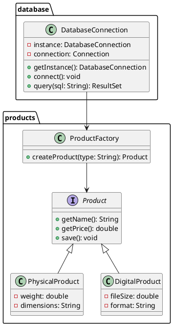

---
tags:
  - 📦DSW
  - 👥TGR
cssclasses:
  - center-titles
---

# Taller Grupal #06

## 🎯 Paso 1: Análisis Rápido (30 minutos)

### 1.1 Identificar Patrones Clave
> [!info] Dos patrones principales
> **Singleton**: Para el componente único de base de datos
> **Factory Method**: Para crear productos físicos/digitales

### 1.2 Definir Estructura Base
```java
// Esqueleto mental
DatabaseManager (Singleton)
Product (Interface)
├── PhysicalProduct
└── DigitalProduct
ProductFactory (Factory Method)
```

---

## 📝 Paso 2: Sección A - Reporte (1.5 horas)

### 2.1 Patrón Singleton
**Objetivo**: Una única instancia de conexión a BD
**Motivación**: Evitar conflictos y duplicar recursos
**SOLID**: Cumple SRP (una sola responsabilidad)

### 2.2 Patrón Factory Method  
**Objetivo**: Crear productos sin saber el tipo concreto
**Motivación**: Extensible para nuevos tipos de productos
**SOLID**: Cumple OCP (abierto para extensión)

> [!success] Formato del Reporte
> - 1 página por patrón
> - Incluir objetivo, motivación, consecuencias
> - Relación con SOLID
> - Supuestos claros

---

## 📊 Paso 3: Sección B - Diagramas UML (2 horas)

### 3.1 Diagrama de Clases (1 hora)


### 3.2 Diagramas de Secuencia (1 hora)
- **Secuencia 1**: Obtener instancia Singleton
- **Secuencia 2**: Crear producto físico
- **Secuencia 3**: Crear producto digital

> [!tip] Herramienta Rápida
> Usa **Draw.io** o **PlantUML** para diagramas rápidos

---

## 💻 Paso 4: Sección C - Código Java (2 horas)

### 4.1 Singleton Database (30 minutos)
```java
// DatabaseConnection.java
public class DatabaseConnection {
    private static DatabaseConnection instance;
    private Connection connection;
    
    private DatabaseConnection() {
        // Inicializar conexión real aquí
    }
    
    public static DatabaseConnection getInstance() {
        if (instance == null) {
            instance = new DatabaseConnection();
        }
        return instance;
    }
    
    public void connect() { /* implementación */ }
    public ResultSet query(String sql) { /* implementación */ }
}
```

### 4.2 Productos y Factory (1 hora)
```java
// Product.java
public interface Product {
    String getName();
    double getPrice();
    void save();
}

// PhysicalProduct.java
public class PhysicalProduct implements Product {
    private String name;
    private double price;
    private double weight;
    private String dimensions;
    
    // constructor, getters, save method
}

// DigitalProduct.java  
public class DigitalProduct implements Product {
    private String name;
    private double price;
    private double fileSize;
    private String format;
    
    // constructor, getters, save method
}

// ProductFactory.java
public class ProductFactory {
    public static Product createProduct(String type, String name, double price) {
        switch (type.toLowerCase()) {
            case "physical":
                return new PhysicalProduct(name, price);
            case "digital":
                return new DigitalProduct(name, price);
            default:
                throw new IllegalArgumentException("Tipo no válido");
        }
    }
}
```

### 4.3 Clase Main de Prueba (30 minutos)
```java
// Main.java
public class Main {
    public static void main(String[] args) {
        // Probar Singleton
        DatabaseConnection db = DatabaseConnection.getInstance();
        
        // Probar Factory
        Product physical = ProductFactory.createProduct("physical", "Libro", 25.99);
        Product digital = ProductFactory.createProduct("digital", "Ebook", 15.99);
        
        System.out.println("Productos creados exitosamente");
    }
}
```

---

## 📦 Paso 5: Documentación Final (1 hora)

### 5.1 Estructura del Documento
```
Carátula (integrantes, materia, fecha)
Tabla de contenido
Sección A: Reporte de patrones (2 páginas)
Sección B: Diagramas UML (2-3 páginas)  
Sección C: Código Java (1-2 páginas)
```

### 5.2 Checklist Final
- [ ] Reporte completo de ambos patrones
- [ ] Diagrama de clases con paquetes
- [ ] Diagramas de secuencia
- [ ] Código Java implementado
- [ ] Documento con carátula y tabla de contenido
- [ ] Todo comprimido en ZIP

---

## ⏱️ Timeline Sugerido para el Día

| Hora | Actividad |
|------|-----------|
| 8:00 - 8:30 | Análisis y planificación |
| 8:30 - 10:00 | Sección A - Reporte |
| 10:00 - 12:00 | Sección B - Diagramas UML |
| 12:00 - 14:00 | Sección C - Código Java |
| 14:00 - 15:00 | Documentación final y empaquetado |

> [!success] ¡Listo para Entregar!
> Sigue estos pasos en orden y tendrás el taller completo en un día.
> **Recuerda**: Mantener el foco en los dos patrones principales.
