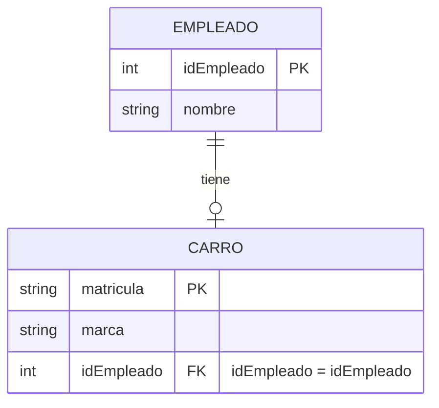
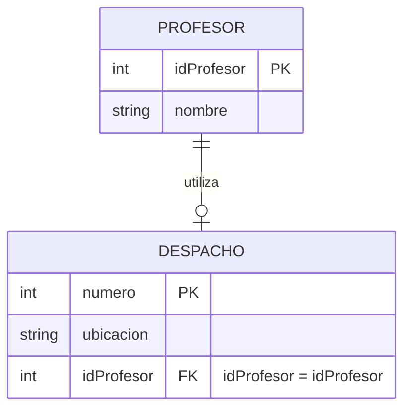
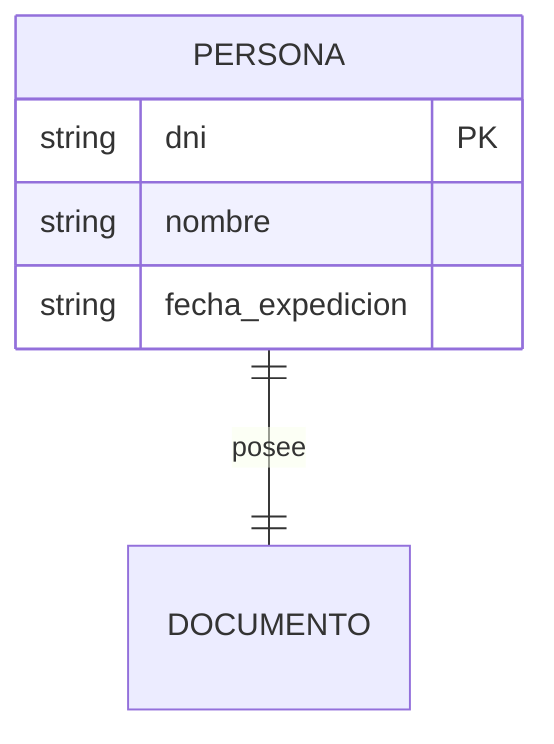
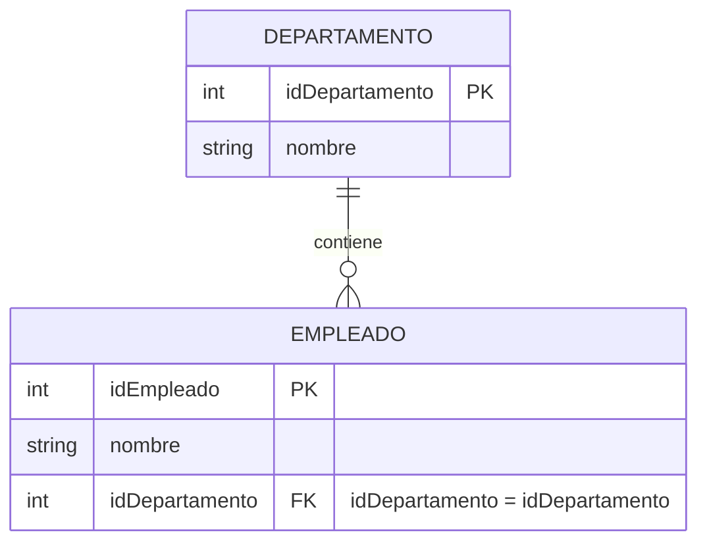
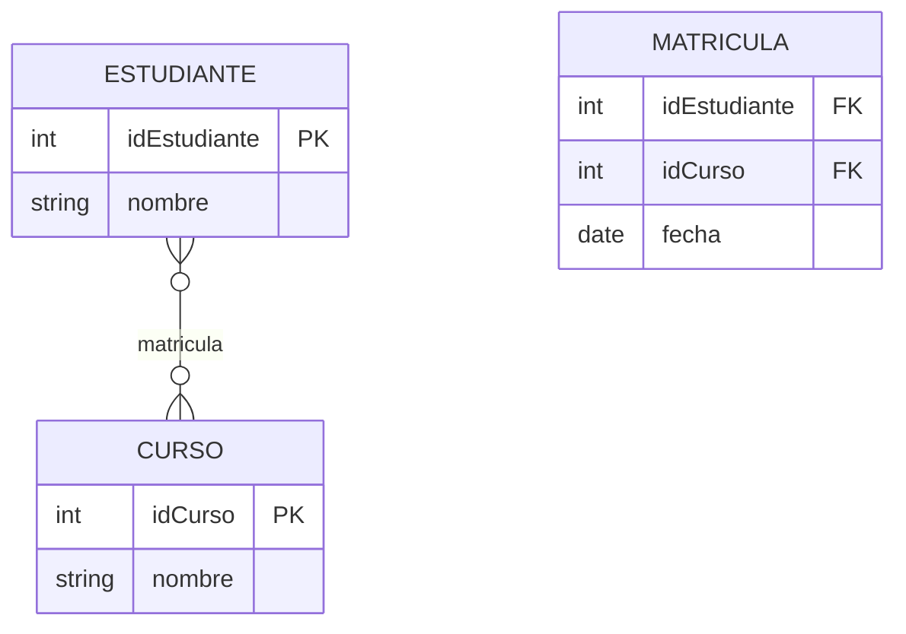
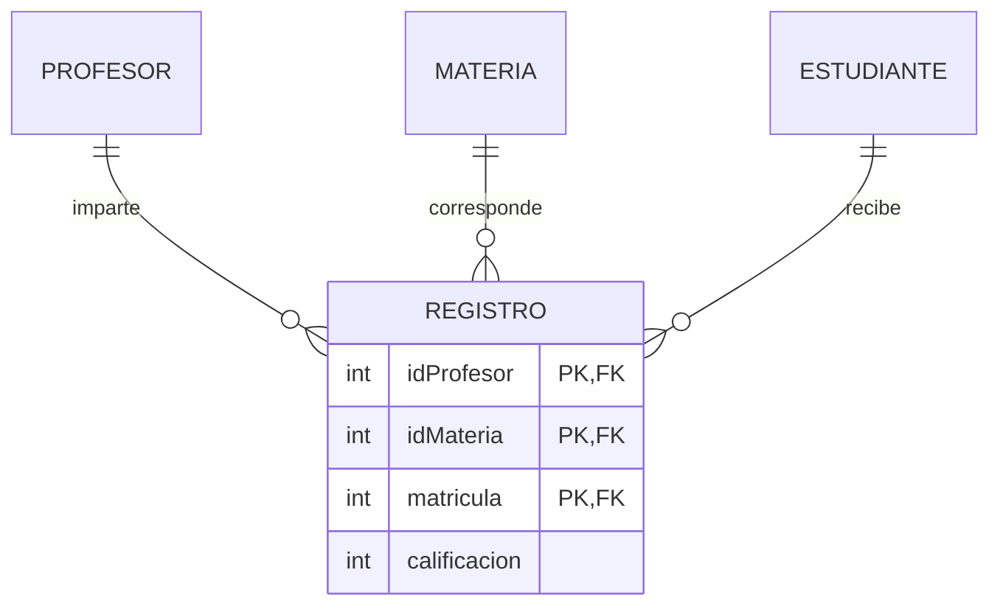
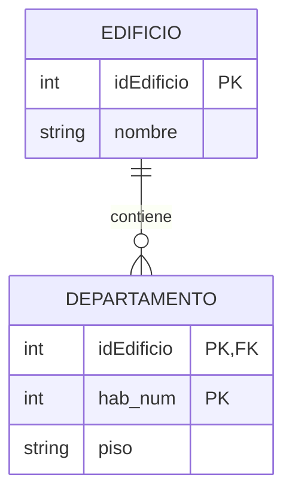
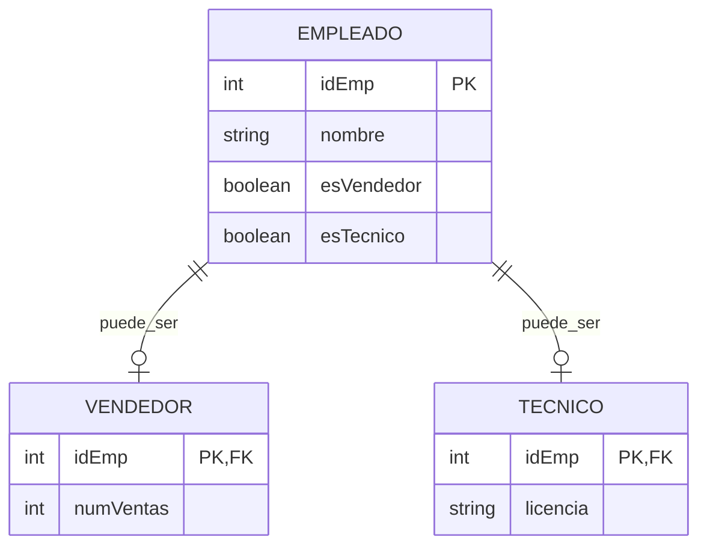

# 3. Conversión de Relaciones

## 3.1 Relaciones 1:1 (Uno a Uno) - Expandido

### Consideraciones Generales sobre Claves Foráneas

> [!note] Notación de Propagación de Claves
> Cuando una clave primaria se propaga como clave foránea a otra tabla, se utiliza la notación:
> - `PK_Origen = FK_Destino` (mismo nombre)
> - `PK_Origen = NuevoNombre_FK` (cuando hay conflicto de nombres)

### Casos de Relaciones 1:1

#### Caso 1: Una Entidad Opcional y la otra Obligatoria

> [!info] Regla
> La tabla **opcional** almacena como FK la PK de la tabla **obligatoria**



> [!example] Implementación SQL
> ```sql
> EMPLEADO (idEmpleado PK, nombre)
> CARRO (matricula PK, marca, idEmpleado FK)
> -- idEmpleado en CARRO referencia idEmpleado en EMPLEADO
> ```

#### Caso 2: Ambas Entidades Opcionales

> [!info] Regla
> Se decide cuál es la **clase padre** y cuál la **clase hijo**. La PK del padre se copia al hijo como FK.



> [!tip] Criterio de Decisión
> - Elegir como padre la entidad más importante o con mayor cardinalidad
> - Si no hay criterio claro, se elige arbitrariamente

#### Caso 3: Ambas Entidades Obligatorias

> [!info] Regla
> Se pueden **unificar en una sola tabla** y elegir como PK cualquiera de las entidades originales.



> [!example] Implementación SQL - Fusión
> ```sql
> PERSONA (dni PK, nombre, fecha_expedicion)
> -- Se unifican PERSONA y DOCUMENTO en una sola tabla
> ```

> [!example] Implementación SQL - Separadas
> ```sql
> PERSONA (idPersona PK, nombre)
> DOCUMENTO (idPersona PK/FK, tipo, numero)
> -- Relación 1:1 con ambas obligatorias
> ```

### Resumen de Estrategias 1:1

| Tipo de Relación | Estrategia | Ejemplo |
|-----------------|------------|---------|
| **Opcional - Obligatorio** | FK en la opcional | Empleado ← Carro |
| **Opcional - Opcional** | FK en el hijo elegido | Profesor → Despacho |
| **Obligatorio - Obligatorio** | Fusión de tablas | Persona + Documento |

---

## 3.2 Relaciones 1:M (Uno a Muchos) - Mejorado

> [!success] Regla General
> La **PK del lado "1"** se propaga como **FK al lado "M"**, independientemente de la obligatoriedad.



> [!example] Implementación SQL
> ```sql
> DEPARTAMENTO (idDepartamento PK, Nombre)
> EMPLEADO (idEmpleado PK, Nombre, idDepartamento FK)
> -- idDepartamento en EMPLEADO referencia idDepartamento en DEPARTAMENTO
> ```

---

## 3.3 Relaciones M:M (Muchos a Muchos)

> [!warning] Regla
> Siempre se crea una **tabla intermedia** con las PKs de ambas entidades como FKs.



---

## 3.4 Relaciones Ternarias

> [!info] Regla General
> Se crea una nueva tabla con las **PK de las tres tablas** como FKs, más los atributos de la relación.



---

## 3.5 Relaciones Recursivas - Expandido

### Relación Recursiva 1:1

> [!example] Empleado suplente de Empleado
> ```sql
> EMPLEADO (idEmpleado PK, nombre, idSuplente FK)
> -- idSuplente referencia idEmpleado en la misma tabla
> ```

### Relación Recursiva 1:M

> [!example] Empleado supervisa Empleados
> ```sql
> EMPLEADO (idEmpleado PK, nombre, idSupervisor FK)
> -- idSupervisor referencia idEmpleado en la misma tabla
> ```

### Relación Recursiva M:M

> [!warning] Requiere tabla intermedia
> ```sql
> EMPLEADO (idEmpleado PK, nombre)
> SUPERVISION (idSupervisor FK, idSupervisado FK)
> -- Ambos campos referencian idEmpleado en EMPLEADO
> ```

---

## 4. Conversión de Relaciones Especiales

### 4.1 Relaciones de Dependencia (Entidades Débiles)

> [!warning] Característica Clave
> La entidad débil tiene **clave compuesta** que incluye la PK de la entidad fuerte.



---

## 4.2 Supertipo - Subtipo - Detallado

### Caso (a): Obligatorio - Solapado



> [!important] Validación
> - `esVendedor` y `esTecnico` no pueden ser ambos FALSE
> - Pueden ser ambos TRUE (solapado)

### Caso (b): Obligatorio - Disjunto

```sql
EMPLEADO (idEmp PK, nombre, tipo ENUM('VENDEDOR','TECNICO') NOT NULL)
VENDEDOR (idEmp PK/FK, numVentas)
TECNICO (idEmp PK/FK, licencia)
-- tipo indica exclusivamente a qué subtipo pertenece
```

### Caso (c): Opcional - Disjunto

```sql
EMPLEADO (idEmp PK, nombre, tipo ENUM('VENDEDOR','TECNICO', NULL))
VENDEDOR (idEmp PK/FK, numVentas)
TECNICO (idEmp PK/FK, licencia)
-- tipo puede ser NULL (solo empleado base)
```

### Caso (d): Opcional - Solapado

```sql
EMPLEADO (idEmp PK, nombre, esVendedor BOOLEAN, esTecnico BOOLEAN)
VENDEDOR (idEmp PK/FK, numVentas)
TECNICO (idEmp PK/FK, licencia)
-- Ambos flags pueden ser FALSE (solo empleado base)
-- Ambos pueden ser TRUE (solapado)
```

---

## 7. Tratamiento de Atributos

### 7.1 Atributos Compuestos

> [!info] Estrategia
> Los atributos compuestos se **descomponen** en atributos simples dentro de la misma tabla.

> [!example] Dirección Compuesta
> ```sql
> CLIENTE (idCliente PK, calle, ciudad, codigo_postal, pais)
> -- En lugar de un solo campo "dirección"
> ```

### 7.2 Atributos Multivaluados

> [!warning] Requieren Tabla Separada
> Siempre generan una **nueva tabla** relacionada.

> [!example] Teléfonos Múltiples
> ```sql
> CLIENTE (idCliente PK, nombre)
> TELEFONO (idCliente FK, telefono PK)
> -- Clave compuesta para permitir múltiples teléfonos
> ```

---

> [!success] Resumen de Conversiones
> | Tipo Relación | Estrategia | Observaciones |
> |---------------|------------|---------------|
> | **1:1 Opcional-Obligatorio** | FK en opcional | - |
> | **1:1 Opcional-Opcional** | FK en hijo elegido | Decisión arbitraria |
> | **1:1 Obligatorio-Obligatorio** | Fusión o FK mutua | Preferible fusión |
> | **1:M** | FK en lado M | Independiente de opcionalidad |
> | **M:M** | Tabla intermedia | Siempre necesario |
> | **Ternaria** | Tabla con 3 FKs | Para 3 entidades |
> | **Recursiva** | FK autoreferencial | M:M requiere tabla |
> | **Dependencia** | Clave compuesta | Entidad débil |