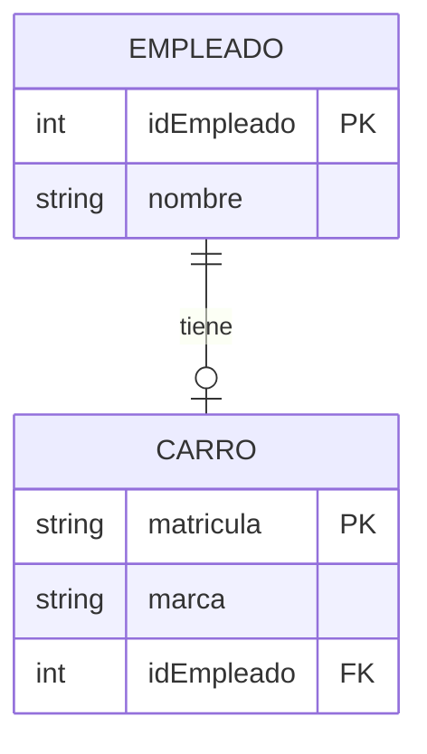
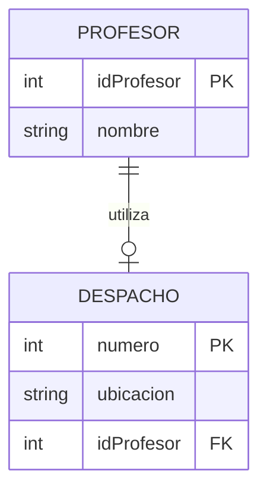
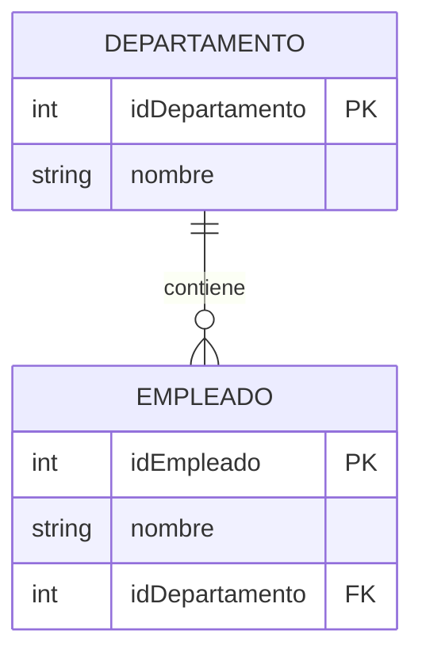
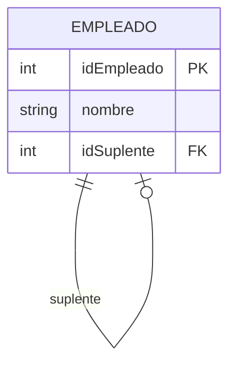
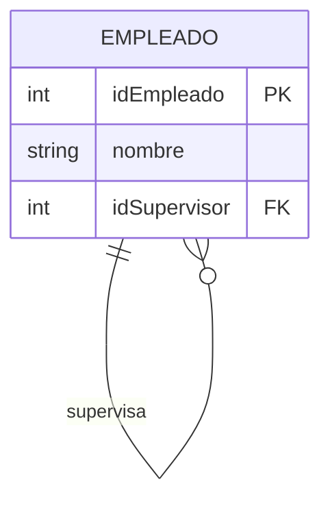
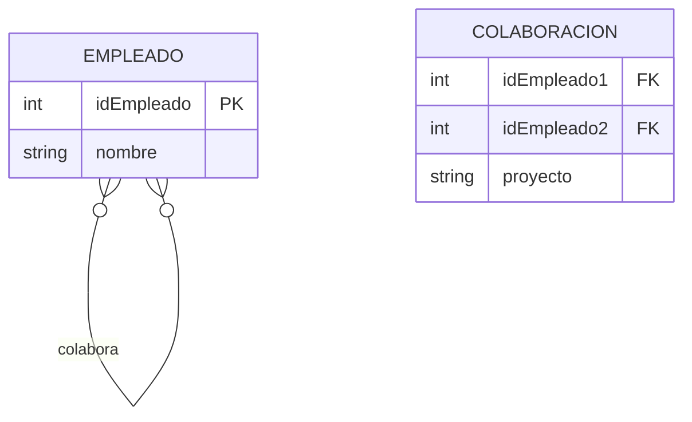

# Modelo Lógico y Normalización - Unidad 2

## 1. Proceso de Diseño de Bases de Datos

> [!example] Video
> ![[Conversión a Modelo Lógico.mkv]]

> [!info] Tres Etapas Principales
> El diseño de una base de datos sigue un proceso estructurado en tres fases principales:

| Etapa                 | Objetivo                                 | Resultado                      |
| --------------------- | ---------------------------------------- | ------------------------------ |
| **Diseño Conceptual** | Identificar datos y restricciones        | Modelo Entidad-Relación (ERD)  |
| **Diseño Lógico**     | Crear tablas, relaciones y restricciones | Esquema relacional normalizado |
| **Diseño Físico**     | Implementar procedimientos y triggers    | Base de datos operativa        |

> [!success] Flujo del Proceso
```

Especificación de Requisitos → Diseño Conceptual → Diseño Lógico → Diseño Físico

```

---

2. Transformación del Modelo Conceptual al Lógico

2.1 Conversión de Entidades

[!info] Reglas Básicas

· Cada entidad se transforma en una tabla
· Los atributos se convierten en columnas
· Las claves primarias se mantienen

[!example] Ejemplo de Conversión

Modelo Conceptual Modelo Lógico
CLIENTE entidad CLIENTE tabla
idCliente (PK) idCliente INT PRIMARY KEY
Nombre, Dirección atributos Nombre VARCHAR(30), Dirección VARCHAR(50)

2.2 Conversión de Atributos

[!warning] Atributos Multivaluados
Los atributos multivaluados requieren una tabla separada:

```
CLIENTE {idCliente, nombre}
TELEFONO {idCliente, telefono}
```

[!info] Atributos Compuestos
Los atributos compuestos se descomponen en atributos simples:

```
CLIENTE {idCliente, nombre, calle, ciudad, codigo_postal}
```

---

3. Conversión de Relaciones

3.1 Relaciones 1:1 (Uno a Uno) - Expandido

Caso 1: Una Entidad Opcional y la otra Obligatoria

[!info] Regla
La tabla opcional almacena como FK la PK de la tabla obligatoria



Descripción: Un empleado puede tener un carro opcionalmente, pero un carro debe pertenecer a un empleado. La FK idEmpleado en CARRO referencia la PK de EMPLEADO.

Caso 2: Ambas Entidades Opcionales

[!info] Regla
Se decide cuál es la clase padre y cuál la clase hijo. La PK del padre se copia al hijo como FK.



Descripción: Tanto profesor como despacho son opcionales. Se elige PROFESOR como padre y se propaga su PK a DESPACHO como FK.

Caso 3: Ambas Entidades Obligatorias

[!info] Regla
Se pueden unificar en una sola tabla y se puede elegir como PK a cualquiera de las entidades originales.


Descripción: Persona y documento son ambos obligatorios. Se unifican en una tabla PERSONA que incluye todos los atributos.

3.2 Relaciones 1:M (Uno a Muchos)

[!success] Regla General
La PK del lado "1" se propaga como FK al lado "M", independientemente de la obligatoriedad.



Descripción: Un departamento puede tener muchos empleados. La PK idDepartamento se propaga como FK a la tabla EMPLEADO.

3.3 Relaciones M:M (Muchos a Muchos)

[!warning] Regla
Siempre se crea una tabla intermedia con las PKs de ambas entidades como FKs.


Descripción: Relación muchos a muchos entre ESTUDIANTE y CURSO. Se crea tabla intermedia MATRICULA con ambas FKs.

3.4 Relaciones Ternarias

[!info] Regla General
Se crea una nueva tabla con las PK de las tres tablas como FKs, más los atributos de la relación.


Descripción: Relación ternaria entre PROFESOR, MATERIA y ESTUDIANTE. Se crea tabla REGISTRO con las tres FKs como PK compuesta.

---

4. Conversión de Relaciones Especiales

4.1 Relaciones de Dependencia (Entidades Débiles)

[!warning] Característica Clave
La entidad débil tiene clave compuesta que incluye la PK de la entidad fuerte.


Descripción: DEPARTAMENTO es entidad débil de EDIFICIO. Su PK es compuesta: (idEdificio, hab_num).

4.2 Relaciones Recursivas

Relación Recursiva 1:1



Descripción: Un empleado puede ser suplente de otro empleado. FK idSuplente referencia PK idEmpleado en la misma tabla.

Relación Recursiva 1:M



Descripción: Un empleado puede supervisar a muchos empleados. FK idSupervisor referencia PK idEmpleado.

Relación Recursiva M:M



Descripción: Empleados pueden colaborar entre sí. Se crea tabla intermedia COLABORACION.

4.3 Supertipo - Subtipo - Detallado

Caso (a): Obligatorio - Solapado


Descripción: Empleado debe ser al menos vendedor o técnico (puede ser ambos). Flags booleanos en tabla padre.

Caso (b): Obligatorio - Disjunto

```
EMPLEADO {idEmp, nombre, tipo NOT NULL}
VENDEDOR {idEmp, numVentas}
TECNICO {idEmp, licencia}
```

Descripción: Empleado debe ser exclusivamente vendedor o técnico. Atributo tipo indica el subtipo.

Caso (c): Opcional - Disjunto

```
EMPLEADO {idEmp, nombre, tipo NULL}
VENDEDOR {idEmp, numVentas}
TECNICO {idEmp, licencia}
```

Descripción: Empleado puede ser vendedor, técnico o solo empleado base. tipo puede ser NULL.

Caso (d): Opcional - Solapado


Descripción: Empleado puede ser vendedor, técnico, ambos, o ninguno. Flags booleanos permiten todas las combinaciones.

---

5. Normalización de Bases de Datos

5.1 Introducción a la Normalización

[!quote] Propósito
"La normalización evita la redundancia de datos, problemas de actualización y protege la integridad de los datos."

5.2 Formas Normales

Forma Normal Descripción Base
1FN Atributos atómicos, clave primaria Estructura básica
2FN Dependencia completa de la clave Claves compuestas
3FN Eliminar dependencias transitivas Dependencias funcionales
FNBC Versión reforzada de 3FN Dependencias funcionales

5.3 Primera Forma Normal (1FN)

[!success] Requisitos

· Atributos atómicos
· Clave primaria única
· Sin grupos repetitivos

❌ Antes (No 1FN) ✅ Después (1FN)
Cliente {ID, Nombre, Teléfonos} Cliente {ID, Nombre}
 Telefono {ID_Cliente, Telefono}

5.4 Segunda Forma Normal (2FN)

[!warning] Solo para claves compuestas
Atributos no clave deben depender de toda la clave

❌ No 2FN ✅ 2FN
EmpleadoHabilidad {Empleado, Habilidad, LugarTrabajo} Empleado {Empleado, LugarTrabajo}
 Habilidad {Empleado, Habilidad}

5.5 Tercera Forma Normal (3FN)

[!danger] Eliminar dependencias transitivas
Atributos no clave no deben depender de otros atributos no clave

❌ No 3FN ✅ 3FN
Torneo {Torneo, Año, Ganador, FechaNacimiento} Torneo {Torneo, Año, Ganador}
 Ganador {Ganador, FechaNacimiento}

---

6. Ejercicios y Casos Prácticos

6.1 Ejercicio de Conversión MC a ML

[!example] Conversión Completa
Dado un modelo ER con:

· Entidades: CLIENTE, PRODUCTO, VENTA
· Relaciones: CLIENTE realiza VENTA (1:N), VENTA contiene PRODUCTO (M:N)
· Atributos multivaluados: múltiples teléfonos por cliente

6.2 Ejercicio de Normalización

[!example] Normalización Paso a Paso

```
PEDIDO {NumPedido, Fecha, Cliente, Direccion, ProductoID, DescProducto, Categoria, Precio, Cantidad}
```

Aplicar 1FN, 2FN y 3FN sucesivamente.
